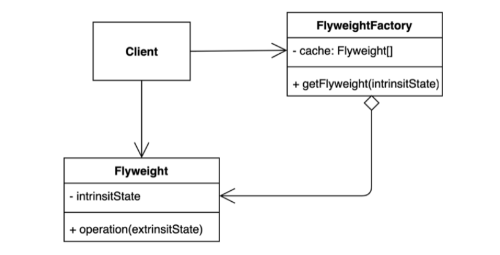

# 아이템 1. 생성자 대신 정적 팩터리 메서드를 고려하라

## 핵심 정리

### 장점

- `이름을 가질 수 있다.(동일한 시그니처 생성자를 두개 가질 수 없다.)`

```java
//시그니처 생성자 중복
public Foo(String name) {
    this.name = name;
}

public Foo(String address) {
    this.address = address;
}
```

```java
// 장점 1. 이름을 가질 수 있다.
public static Foo withName(String name) {
    return new Foo(name);
}
```

- `호출될 때마다 인스턴스를 새로 생성하지 않아도 된다.(Boolean.valueOf)`

```java
/* 장점 2. 호출될 때마다 인스턴스를 생성하지 않아도 된다.
 Foo.INSTANCE 와 getInstance()*/
private static final Foo INSTANCE = new Foo();

public static Foo getInstance() {
    return INSTANCE;
}
```

```java

// Boolean.class
/**
 * The {@code Boolean} object corresponding to the primitive
 * value {@code true}.
 */
public static final Boolean TRUE = new Boolean(true);

public static Boolean valueOf(boolean b) {
    return (b ? TRUE : FALSE);
}
```

- `반환 타입의 하위 타입 객체를 반환할 수 있는 능력이 있다.(인스턴스 기반 프레임워크, 인터페이스에 정적 메소드)`

```java
/* 장점 3. 반환 타입의 하위 타입 객체를 반환할 수 있는 능력이 있다.
 java8 부터는 인터페이스가 정적 메서드를 가질 수 없다는 제한이 풀렸습니다.
 java9 부터는 private 정적 메서드까지 허용합니다.

 정적 메서드들을 구현하기 위한 코드 중 많은 부분이 여전히 별도의
 package-private 클래스에 두어야 할 부분이 존재합니다.
 또한, 정적 필드와 정적 멤버 클래스는 여전히 public 이어야 합니다.*/
public interface FooInterface {

    static Foo getInstance() {
        return new Foo();
    }
}
```

인터페이스에서 접근지시자를 지정하지 않으면 public으로 간주한다.(클래스의 경우 package-private)

- `입력 매개변수에 따라 매번 다른 클래스의 객체를 반환할 수 있다.(EnumSet)`

```java
public static void main(String[] args) {
    Foo foo1 = new Foo("name");
    Foo foo2 = Foo.withName("name");// 장점 1. 명확한 이름을 가지고 있다.

    //장점 4. 입력 매개변수에 따라 매번 다른 클래스의 객체를 반환할 수 있다.
    EnumSet<Color> colors = EnumSet.allOf(Color.class);
    EnumSet<Color> redAndBlue = EnumSet.of(Color.RED, Color.BLUE);
}
```

- `정적 팩터리 메서드를 작성하는 시점에는 반환할 객체의 클래스가 존재하지 않아도 된다.(서비스 제공자 프레임워크)`

```java
/* 장점 5. 정적 팩터리 메소드를 작성하는 시점에는 반환할 객체의 클래스가 존재하지 않아도 된다.
 JDBC, 서비스 제공자에게 공급을 받는다.
 */
public static Foo getInstance2(boolean flag) {
    Foo foo = new Foo();
    // 어떤 특정 약속 되어 있는 텍스트 파일에서 Foo의 구현체의 FQCN(foo qualified class name) 을 읽어온다.
    // FQCN 에 해당하는 인스턴스를 생성한다.
    // foo 변수를 해당 인스턴스를 가리키도록 수정한다.
    return foo;
}
```

```java
import java.util.Optional;
import java.util.ServiceLoader;

public static void main(String[] args) {
		ServiceLoader<HelloService> loader = ServiceLoader.load(HelloService.class);
		Optional<HelloService> helloServiceOptional = loader.findFirst();
}
```

### 단점

- `상속을 하려면 public 이나 protected 생성자가 필요하니 정적 팩터리 메서드만 제공하면 하위 클래스를 만들 수 없다.`

다시말해 정적 팩터리 메서드를 제공하고 private 생성자만 존재하는 경우 상속이 불가하다는 의미.

- `정적 팩토리 메서드는 프로그래머가 찾기 어렵다.`

## 완벽 공략

### 완벽 공략 1. 열거 타입(Enumeration)

- `p9, 열거 타입은 인스턴트가 하나만 만들어짐을 보장한다.`
    - 상수 목록을 담을 수 있는 데이터 타입.
    - **특정한 변수가 가질 수 있는 값을 제한**할 수 있다. 타입-세이프티(Type-Safety)를 보장할 수
    있다.
    - 싱글톤 패턴을 구현할 때 사용하기도 한다.
- 질문1) 특정 enum 타입이 가질 수 있는 모든 값을 순회하며 출력하라.

```java
enum OrderStatus {
		PREPARING, SHIPPED, STOP
}

OrderStatus.values();
```

- 질문2) enum은 자바의 클래스처럼 생성자, 메소드, 필드를 가질 수 있는가?

있다.

- 질문3) enum의 값은 == 연산자로 동일성을 비교할 수 있는가?

있다. == 연산자를 사용하는 것을 권장한다. 싱글톤 객체이기 때문에 == 비교해도 무방하다 equals 동등성 비교의 경우 NPE가 발생할 가능성이 있지만 == 비교는 NPE 가능성이 없다.

```java
enum Status {
    A, B
}

public static void main(String[] args) {
		Status status = Status.A
		// status 가 null인 경우 NPE 발생 가능
    System.out.println(status.equals(Status.A));
    System.out.println(status == Status.A);
}
```

- 과제) enum을 key로 사용하는 Map을 정의하세요. 또는 enum을 담고 있는 Set을 만들어
보세요.

```java
public enum Status {
    A, B
}

public static void main(String[] args) {
    EnumSet<Status> statusSet = EnumSet.of(Status.A, Status.B);
    EnumMap<Status, String> statusMap = new EnumMap<>(Status.class);
}
```

EnumMap 참고: [https://yeonyeon.tistory.com/195](https://yeonyeon.tistory.com/195)

### 완벽 공략 2. 플라이웨이트 패턴

- `p9, 같은 객체가 자주 요청되는 상황이라면 플라이웨이트 패턴을 사용할 수 있다.`
    
    
    
    - 객체를 가볍게 만들어 메모리 사용을 줄이는 패턴.
    - 자주 변하는 속성(또는 외적인 속성, extrinsit)과 변하지 않는 속성(또는 내적인 속성, intrinsit)을 분리하고 재사용하여 메모리 사용을 줄일 수 있다.

### 완벽 공략 3. 인터페이스에 정적 메소드

- `p10, 자바 8부터는 인터페이스가 정적 메서드를 가질 수 없다는 제한이 풀렸기 때문에 인스턴스화 불가 동반 클래스를 둘 이유가 별로 없다.`

```java
public interface HelloService {
    void hello();

    default String hi() {
        return "hi";
    }

    static String bye() {
        return "bye";
    }
		// java9 부터 private static 메소드 선언 가능
		private static void commonMethod() {
    }
}
```

- **기본 메소드(default method)**와 **정적 메소드**를 가질 수 있다.
- **기본 메소드**
    - 인터페이스에서 메소드 선언 뿐 아니라, 기본적인 구현체까지 제공할 수 있다.
    - 기존의 인터페이스를 구현하는 클래스에 새로운 기능을 추가할 수 있다.
- **정적 메소드**
    - 자바 9부터 private static 메소드도 가질 수 있다.
    - 단, private 필드는 아직도 선언할 수 없다.

<aside>
💡 p10, 자바8 전에는 인터페이스에 정적 메서드를 선언할 수 없었다. 그래서 인터페이스를 반한하는 정적 메서드가 필요하다면 **인스턴스화 불가인 동반 클래스(companion class)를 만들어 그 안에 정의**하는 것이 관례였다.

*인스턴스화 불가인 동반 클래스: final 클래스 + private 생성자(상속을 막기 위함)인 클래스를 말함 상속을 막는 이유는 하위 클래스에서 상위 클래스의 인스턴스를 만들 수 있기 때문

</aside>

- 질문1) 내림차순으로 정렬하는 Comparator를 만들고 List<Integer>를 정렬하라.
- 질문2) 질문1에서 만든 Comparator를 사용해서 오름차순으로 정렬하라.

```java
@Test
void sort() {
    //질문1
    List<Integer> numbers = new ArrayList<>(List.of(49, 42, 64, 4, 31, 73, 77));
    Comparator<Integer> desc = (o1, o2) -> o2 - o1;
    numbers.sort(desc);
    System.out.println(numbers);

    //질문2
    numbers.sort(desc.reversed());
    System.out.println(numbers);
}
```

### 완벽 공략 4. 서비스 제공자 프레임워크

확장 가능한 애플리케이션 만드는 방법

- `p11, 서비스 제공자 프레임워크를 만드는 근간이 된다.`
- `p12, 서비스 제공자 인터페이스가 없다면 각 구현체를 인스턴스로 만들 때 리플렉션을 사용해야 한다.`
- `p12, 브리지 패턴`
- `p12, 의존 객체 주입 프레임워크`

객체를 확장 가능한 구조를 만드는데 활용 가능하다는 의미

- 주요 구성 요소
    - 서비스 제공자 인터페이스 (SPI)와 서비스 제공자 (서비스 구현체)
    - 서비스 제공자 등록 API (서비스 인터페이스의 구현체를 등록하는 방법)
    - 서비스 접근 API (서비스의 클라이언트가 서비스 인터페이스의 인스턴스를 가져올 때 사용하는 API)
- 다양한 변형
    - 브릿지 패턴
        - 구현과 추상 사이의 다리 역할을 하는 패턴
        - PAS(Portable Service Abstract) 참고
    - 의존 객체 주입 프레임워크
    - java.util.ServiceLoader
        - [https://docs.oracle.com/javase/tutorial/sound/SPI-intro.html](https://docs.oracle.com/javase/tutorial/sound/SPI-intro.html)
        - [https://docs.oracle.com/javase/tutorial/ext/basics/spi.html](https://docs.oracle.com/javase/tutorial/ext/basics/spi.html)

### 완벽 공략 5. 리플렉션

- 클래스로더를 통해 읽어온 클래스 정보(”거울에 반사”된 정보)를 사용하는 기술
- 리플렉션을 사용해 클래스를 읽어오거나, 인스턴스를 만들거나, 메소드를 실행하거나,
- 필드의 값을 가져오거나 변경하는 것이 가능하다.
- 언제 사용할까?
    - 특정 애노테이션이 붙어있는 필드 또는 메소드 읽어오기 (JUnit, Spring)
    - 특정 이름 패턴에 해당하는 메소드 목록 가져와 호출하기 (getter, setter)
- [https://docs.oracle.com/javase/tutorial/reflect/](https://docs.oracle.com/javase/tutorial/reflect/)

```java
public class ReflectionTest {

    @Test
    void reflection() throws ClassNotFoundException, NoSuchMethodException, IllegalAccessException, InvocationTargetException, InstantiationException {
        Class<?> clazz = Class.forName("item1.HelloService");
        Constructor<?> constructor = clazz.getConstructor();
        HelloService helloService = (HelloService) constructor.newInstance();
        System.out.println("helloService.hello() = " + helloService.hello());
    }
}
```

결론은 위 코드와 같이 리플렉션 기술을 통해서 클래스 인스턴스를 생성하여 활용할 수 있다는 의미

## 참고: 정적 팩토리 메소드 네이밍 컨벤션

- `from`: 매개변수를 하나 받아서 해당 타입의 인스턴스를 반환하는 형변환 메서드
    - ex) Date date = Date.from(instant);
- `of`: 여러 매개변수를 받아 적합한 타입의 인스턴스를 반환하는 집계 메서드
    - ex) Set<UserStatus> statuses = EnumSet.of(ACTIVE, STOP);
- `valueOf`: from과 of의 더 자세한 버전
    - ex) BigInteger prime = BigInteger.valueOf(Integer.MAX_VALUE);
- `instance`, `getInstance`: (매개변수를 받는다면) 매개변수로 명시한 인스턴스를 반환하지만, 같은 인스턴스임을 보장하지는 않는다.
    - ex) Calendar instance = Calendar.getInstance(Locale.KOREA);
- `create`, `newInstance`: instance 혹은 getInstance와 같지만, 매번 새로운 인스턴스를 생성해 반환함을 보장
    - ex) Object newArray = Array.newInstance(String.class, 10);
- `getType`: getInstance와 동일, 생성할 클래스가 아닌 다른 클래스에 팩토리 메서드를 정의할 때 사용.(Type은 팩토리 메서드가 반환할 객체의 타입)
    - ex) FileStore fs = Files.getFileStore(path);
- `newType`: newInstance와 동일, 생성할 클래스가 아닌 다른 클래스에 팩토리 메서드를 정의할 때 사용.
    - ex) BufferedReader br = Files.newBufferedReader(path);
- `type`: getType과 newType의 간결한 버전
    - ex) List<Complaint> list = Collections.list(legacyLitany);
